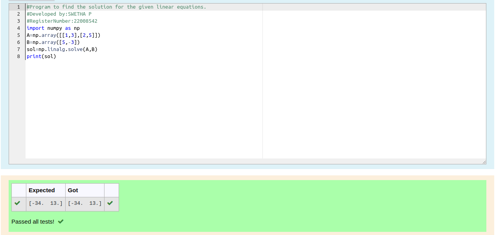

# -SOLUTION-TO-A-SYSTEM-OF-LINEAR-EQUATIONS

## Aim:

To write a python program to find a solution to a system of linear equations.

## Equipment’s required:

1. 	Hardware – PCs
2. 	Anaconda – Python 3.7 Installation / Moodle-Code Runner

## Algorithm:

### Step 1: 
Import the numpy module to use the built-in functions for calculation
### Step 2: 
Prepare the lists from each linear equations and assign in np.array()
### Step 3: 
Using the np.linalg.solve(), we can find the solutions.
### Step 4: 
End the program

## Program:

```python
#Program to find the solution for the given linear equations.
#Developed by:SWETHA P
#RegisterNumber:22008542
import numpy as np
A=np.array([[1,3],[2,5]])
B=np.array([5,-3])
sol=np.linalg.solve(A,B)
print(sol)
```
## Output:


## Result: 
Thus the solutions for the linear equations are successfully solved using python program

